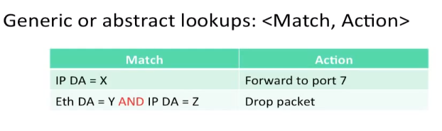

# CS 144 Note #8

## packet switch

一般的分组交换机工作流程如下

带有多个输入和输出，每个 packet 首先通过 forwarding table 查找地址，然后更新头部，最后放入输出队列中

### Ethernet Switch

Ethernet Switch 可以作为 packet switch 的一个例子，对于每个到达的 packet，它将做四件事

- 寻找到每个到达帧的头部
- 如果该帧的 Ethernet DA 在 forwarding table 中，将其转发到对应的端口
- 如果该帧的 Ethernet DA 不在 forwarding table 中，将其广播到出了到达端口以外的所有端口
- 通过查看 arriving packets 的 SA 来更新 forwarding table 的条目 (learn)

> Ethernet Address 其实就是以太网网卡的物理地址，也就是 MAC 地址

### Internet Router

Internet Router 也可以作为 packet switch 的一个例子，它需要做的工作如下

- 如果到达帧的 Ethernet DA 属于这个路由器，就接受，否则将该帧丢弃
- 检查 IP 数据报的长度和 IP 版本
- 将 IP 数据报的 TTL 减一并更新 checksum
- 检查 TTL 是否为零，如果是，则将该帧丢弃
- 如果 IP DA 在 forwarding table 中，将其放到表中下一跳的出口端口
- 找到下一跳路由器的 Ethernet Address 作为 Ethernet DA (ARP)
- 创建一个新的以太网帧然后发送

### Summary

一个 packet switch 的基本操作可以总结为以下两个

- Lookup Address
- Switching

## Lookup Address

### Ethernet

### IP

相比于 Ethernet，IP 的匹配使用的是最长前缀匹配而不是完全匹配。Longest prefix match 主要有两种实现方法。

#### Binary tries

01字典树

#### TCAM

CAM 指 Content Addressable Memory，即内容寻址存储器，通过将查询值与所有数据项同时进行比较，达到高效按值寻址的效果。

TCAM 中每个存储单元具有三态，因此可以完成不完全匹配的任务，只需要将前缀的剩余字符用 X 填充即可匹配所有具有该前缀的地址。

### Generic

通用查询，将 match 和 action 抽象出来，让 router 和 switch 可以实现更广泛的操作。