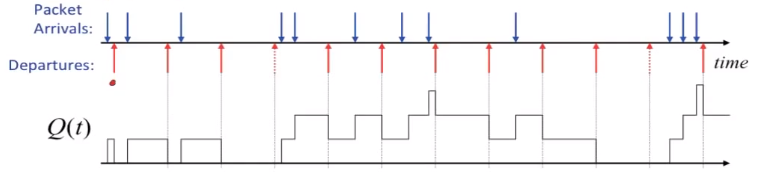
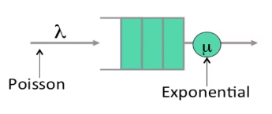

# CS 144 Note #7

## Queue Property

### Burstiness increases delay

相对于数据包均匀的到达，相同的数据量下，数据包突发到达会增加延迟。

### Determinism minimizes delay

与上一条意思相同。

### Little's Result

排队论中的结论，对于一个平均到达率为 $\lambda$，平均人数为 $L$ 的排队系统来说，队列平均延迟 $d$ 满足如下关系
$$L = \lambda d$$

## Poisson process

我们常常使用泊松过程来描述 packet arrival。但这不意味着实际上 packet arrival 就是一个泊松过程，具体如下：

- 网络通信十分具有突发性
- 已经证明了 packet arrival 并不是泊松过程
- 但是使用泊松过程来描述新数据流的到达在数学上足够简洁，且其结果与网络中真实发生的事情在很大程度上相吻合

### M/M/1 Queue

该队列的输入和输出的时间间隔都服从指数分布，参数分别为 $\lambda$ 和 $\mu$

可以证明，平均延迟为
$$d = \frac{1}{\mu-\lambda}$$

$\lambda$ 变大的时候，意味着突发性更高（指数分布，发生时间间隔较小的概率变高），此时平均延迟会增大，也就印证了前文讲到的 **Burstiness increases delay**。