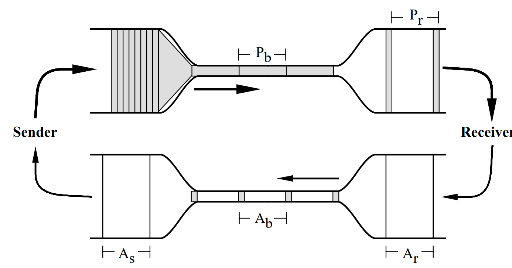

# CS 144 Note #11

可以将 TCP 分割成以下几个问题：

- 何时发送新数据
- 何时应该重传数据
- 何时应该发送 acknowledgement

## TCP Tahoe

TCP Tahoe 在原来的 TCP 基础上

- Congestion window
- Timeout estimation
- Self-clocking

### Congestion window

#### TCP Pre-Tahoe

最早的 TCP 协议机制如下

- 在终端存在 flow control window
- 连接建立后，直接发出等于 window 总大小的 packet
- 为每个 packet 设置一个重传计时器

这个方案缺少拥塞控制，window 可能远大于网络能承载的大小

congestion window 和 flow window 不同，后者只考虑 endpoint 的缓存容量，前者考虑的是网络的承载能力。

$$
    Sender \ window = min(flow \ window, congestion \ window)
$$

将 congestion control 分为两个部分

- slow start
- congestion avoidance

#### slow start

- window 初始大小为 MSS (Maximum Segment Size)
- 每次接受到 ack，window 大小增加 MSS，所以大小是指数增长的（一开始一个 MSS 一个 ack 就加一，然后两个 MSS 两个 ack 就加二，然后4 个 MSS 4 个 ack 就加四，以此类推）

#### Congestion avoidance

- 每次 ack，window 大小增加 $\dfrac{MSS^2}{congestion \  window}$
- 实际上就是每个 RTT 增加一个 MSS（实际上每个 RTT 收到 $\dfrac{congestion \ window}{MSS}$ 个 ack）

#### TCP Tahoe FSM

window size 变化如下图（这里 ssthread 第二次没变是因为整数四舍五入了）

> 现在可以解答 “何时发送新数据” 这个问题：当 flow control window 和 congestion window 大小允许时，TCP-Tahoe 发送新数据。congestion window 由 sender 收到 ack 或超时来动态调整。

### Timeout estimation

RTT estimation 对于判断 timeout 非常重要。

- 如果预测的 RTT 太短，很容以判断超时，会浪费很多容量在重传上，且会很容易跳转到慢启动状态
- 如果预测的 RTT 太长，则有很多空闲时间

#### TCP Pre-Tahoe estimation

exponentiality weighted moving average

$$
    r = \alpha r + (1-\alpha) m
$$

其中 $r$ 是原有的 RTT 预测值，$m$ 是最新一次的 RTT 测量值。

超时时间 $t = \beta r,\ \beta = 2$

这种方法的问题是，由于网络的动态，RTT 的分布可能不同，对于一些情况，可能大部分时候 RTT 都集中在 $r$ 附近，这样对超时时间的估计就十分保守。而在另一些情况下，有 50% 的 RTT 集中在 $r$ 附近，而 30% 的 RTT 大于 $2r$，这种情况下用此方法估计的超时时间就不够合理。

#### TCP Tahoe estimation

TCP Tahoe 通过计算方差来解决上面所讲的估计方法的问题

### Self-Clocking

