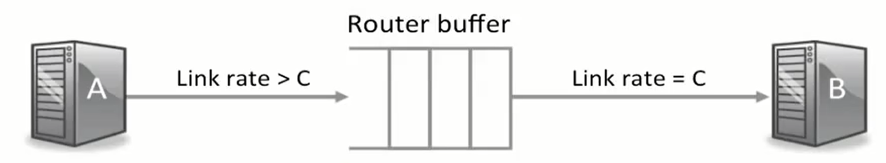

# CS 144 Note #10

## AIMD in single flow

可以在 http://guido.appenzeller.net/anims 看到 single flow AIMD 的动画。

在 single flow 中，如果 buffer 的大小足够大，使用 AIMD 进行拥塞控制不会降低出口速率（瓶颈速率）。

当出现 packet lost 的时候，实际上丢的是 buffer 中的 packet，说明此时 buffer 已满，需要下调拥塞窗口。

当 flow 趋于稳定后，$\dfrac{W}{RTT}$ 是一个常数。

### buffer size

为了保证 output link 时刻被完全占用，我们需要保证 buffer 不能太小，buffer 的最小值为

$$
    RTT \times C
$$

其中 $C$ 为出口速率

## AIMD in mutiple flow

### 与 single flow 的区别

在 single flow 中，throughput 可以被精确计算为 $\dfrac{W(t)}{RTT(t)}$，但是在 mutiple flow 中，由于通常 router 中存在大量的 flow，buffer 中存在来自各个节点的 packet，所以可以认为 buffer 一直保持在满的状态，即 $RTT$ 可以看作一个定值，throughput 可以认为和 $W$ 有关，即 $\dfrac{W(t)}{RTT}$

可以看到上图中 single flow 的 cwnd 上升曲线是弯曲的，这是因为每次加法增大对应的时间（即 RTT）在不断增大，而增大的量不变，所以曲线斜率会不断变小。而对于 multiple flow，由于 RTT 可以认为是定值，所以上升曲线是直线。

### throughput

cwnd 曲线两个 drop 之间的面积是传输的总 packets 数

$$
    A = \dfrac{3}{8} W_{max}
$$

由于两个 drop 之间丢失一个 packet，所以丢包率可以表示为 $p = \dfrac{1}{A}$。两个 drop 之间的时间为 $\dfrac{W_{max}}{2}RTT$，所以 through 可以表示为

$$
    R = \frac{A}{\dfrac{W_{max}}{2}RTT} = \sqrt{\dfrac{3}{2}}\dfrac{1}{RTT\sqrt{p}}
$$

从上式中我们得到两个结论

- 当 RTT 增大时，throughput 会变小，这就导致使用 AIMD 与更远的服务器通信时，我们的传输速率会降低，我们并不希望一个拥塞控制算法有这样的性质，这是 AIMD 的弊端。
- 当 p 减小时，throughput 会变大，这实际上是 AIMD 算法想要达到的效果，即如果没发生丢包，则不断增大 cwnd，如果丢包率为零，则可以无限增大 cwnd，即无限增大 throughput
