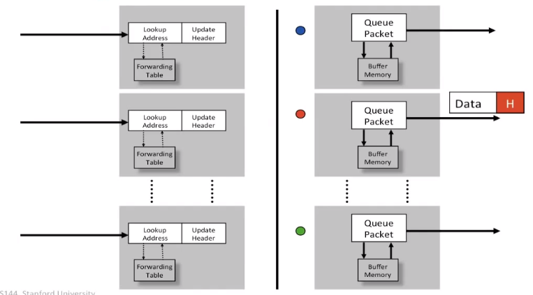
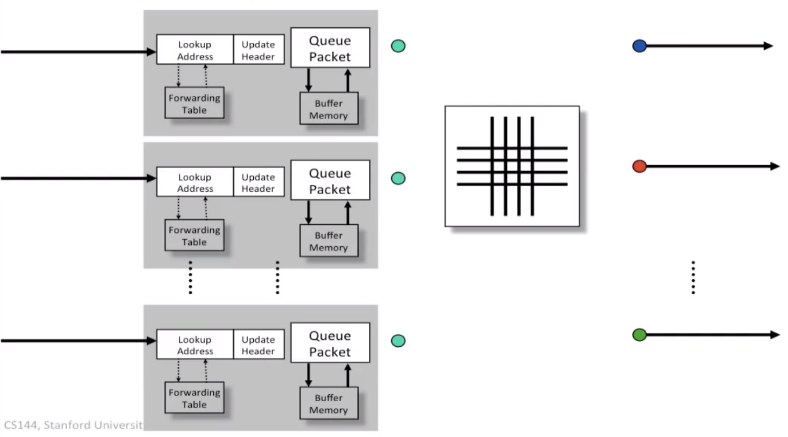
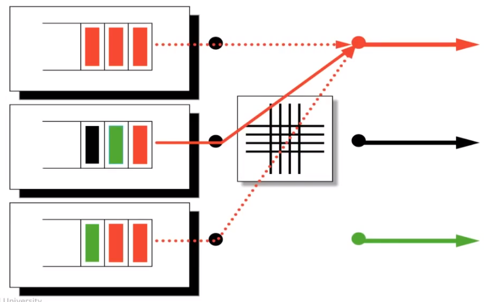

# CS 144 Note #9

## Output Queue

如下图所示，Output Queue 在每个输出端口设置一个队列来缓存待发送的 packet

这种方法存在一个问题，假设每个输入端口接受率为 $R$，输出端口的发送率为 $R$，在最坏情况下，所有进入的 packet 的输出端口均为同一个，那么该输出端口的对应队列将以 $N\times R$ 速率接受到数据，同时以 $R$ 的效率发出数据，那么就要求该队列对应的 buffer 具有 $(N+1)\times R$ 的传输效率，$N$ 的值一般都会成百上千，这对硬件具有很高要求，一般难以实现。（通常我们只要求让 buffer 效率为 $2R$）

## Input Queue

通过将队列移动到输入端口处可以解决 OQ 的问题，如下图

这样每个队列的传输效率只需要 $2R$ 即可。

### Head of Line Blocking

Input queue 也存在自己的问题，由于 FIFO 的缘故，队头的 packet 如果在等待其他输入端口传输数据到输出端口，那么该队列中的所有 packet 都需要等待，即使后面的 packet 对应输出端口空闲

## Virtual Output Queue
